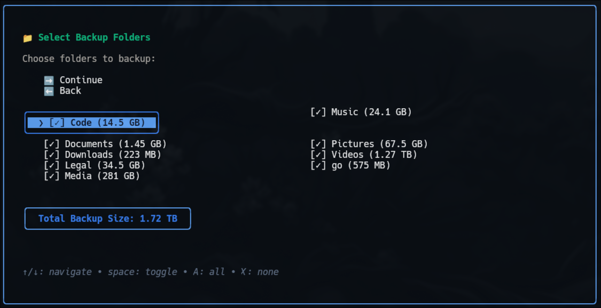

# Migrate

A stunningly beautiful **Terminal** backup and restore tool built with [Bubble Tea](https://github.com/charmbracelet/bubbletea) and [Lipgloss](https://github.com/charmbracelet/lipgloss). Features Tokyo Night theming, pure Go implementation with zero external dependencies, and production-ready performance with selective backup capabilities.


## 🔥 **Live System Backup & Restore**

**The game changer:** Migrate backs up and restores **running live systems** - no downtime required.

Unlike traditional tools that require booting from external media (looking at you, CloneZilla), Migrate works seamlessly on your **active, running OS**. When you're ready to restore, simply:

1. **Fresh install** your OS
2. **Run the restore**
3. **💥 You're back up and running** - exactly as you left it

**No external boot disks. No system downtime. Just pure magic.** ✨

> ✅ **Production Ready**: Recently underwent extensive optimization and bug fixes. All major performance and reliability issues have been resolved as of July 2025.

## ✨ Features

- 🎨 **Beautiful TUI** - Tokyo Night color scheme with smooth animations
- 🚀 **Pure Go** - Zero external dependencies, single static binary
- 💾 **System Backup** - Complete 1:1 backup or selective home directory backup
- 🔍 **Verification** - Comprehensive backup integrity checking with progress tracking
- 🔄 **Smart Sync** - SHA256-based deduplication, automatic cleanup of deleted files
- 📊 **Real-time Progress** - File-based progress tracking with accurate estimates
- 🔒 **LUKS Support** - Works with encrypted external drives
- ⚡ **Blazingly Fast** - Optimized exclusion patterns for maximum performance
- 🎯 **Selective Backup** - Granular folder control with intelligent defaults

## 🚀 Installation

### Download Binary (Recommended)

```bash
curl -L -o migrate https://github.com/CyphrRiot/Migrate/raw/main/bin/migrate
chmod +x migrate
mv migrate ~/.local/bin/  # optional
```

### Build From Source

```bash
git clone https://github.com/CyphrRiot/Migrate.git
cd Migrate
make build     # or: go build -o bin/migrate .
make install   # optional
```

## 🖥️ Usage

```bash
migrate
```

That's it! The tool launches a beautiful TUI interface:

- 🎨 Navigate with arrow keys and Enter
- 🔍 Automatically detects external drives
- 📊 Watch real-time progress with smooth animations
- ✅ Access backup, restore, and verification options from the main menu

## ⚙️ How It Works

### rsync --delete Equivalent

Performs the equivalent of `rsync -aAx --delete / /backup/destination/` but with:

- **SHA256 verification** - Stronger integrity than timestamp comparison
- **Better logging** - Detailed statistics on copied vs. skipped files
- **Zero dependencies** - No rsync binary required
- **Beautiful interface** - Progress tracking and status updates
- **Smart exclusions** - Optimized pattern matching for maximum performance

### Smart Features

- **File deduplication** - Skip identical files using SHA256 hashes
- **Incremental backups** - Only copy changed/new files
- **Automatic exclusions** - `/dev`, `/proc`, `/sys`, `/tmp`, backup destination
- **Progress accuracy** - File-based tracking: `(processed / total) * 85% + cleanup * 15%`
- **Performance optimization** - Smart cache pattern exclusions boost speed dramatically

## 🔄 Enhanced Restore

**Intelligent restore with folder selection** for home directory backups - restore exactly what you need with the same beautiful interface used for backups.

### ✨ Key Features

- **🏠 Automatic Backup Detection** - Detects HOME vs SYSTEM backups automatically
- **📁 Folder Selection UI** - Choose which folders to restore from your backup
- **🎯 Selective Restoration** - Restore only the folders you need
- **⚙️ Restore Options** - Control configuration and window manager restoration
- **📊 Size Calculation** - See exactly how much data will be restored
- **🔒 Safe Operations** - Multiple confirmation steps prevent accidental overwrites

### 🎛️ How It Works

When restoring a **HOME backup**:

1. **Backup Detection** - Automatically identifies backup type from BACKUP-INFO.txt
2. **Folder Discovery** - Scans backup for available folders with size information
3. **Selection Interface** - Same beautiful UI as backup folder selection
4. **Restore Options** - Choose to restore configuration files and window managers
5. **Selective Sync** - Only restores selected folders with full rsync --delete behavior

### 📊 Restore Options

- **☑️ Restore Configuration** - Restores ~/.config directory (enabled by default)
- **☑️ Restore Window Managers** - Restores Hyprland, GNOME, i3, etc. (enabled by default)

### 🔒 Safety Features

- **Automatic Type Detection** - System backups restore to /, HOME backups to ~/
- **Folder-by-Folder Restoration** - Each folder restored independently for reliability
- **Comprehensive Logging** - All operations logged for debugging
- **Multiple Confirmations** - Prevents accidental data overwrites

## 🔍 Backup Verification

**Comprehensive integrity checking** ensures your backups are complete and trustworthy with beautiful real-time progress tracking.

### ✨ Key Features

- **🔍 Complete System Verification** - Full backup integrity check against source system
- **🏠 Home Directory Verification** - Granular verification of selective backups
- **📊 Real-Time Progress** - Smooth progress tracking with Tokyo Night styling
- **🎯 Smart Sampling** - Efficient random sampling for large backup verification
- **⚡ SHA256 Validation** - Cryptographic verification using existing file comparison logic
- **📋 Detailed Reporting** - Comprehensive missing file reports with option to save logs

### 🎛️ How Verification Works

When you select **"🔍 Verify Backup"**:

1. **Drive Detection** - Automatic discovery of backup drives
2. **Read-Only Mounting** - Safe mounting of backup source for verification
3. **Critical File Check** - Validates essential system files first
4. **Random Sampling** - Efficiently checks representative file samples
5. **Comprehensive Report** - Lists any missing files and backup integrity status

### 🔒 Verification Types

- **Complete System** - Verifies full system backups against root filesystem
- **Home Directory** - Validates selective home directory backups
- **Background Processing** - Verification runs asynchronously with progress tracking
- **Log Generation** - Optional saving of verification results to `~/migrate-verified.log`

### 📊 Progress Display

Verification features the same beautiful Tokyo Night progress bars with:

- **Time-Based Progress** (70%) - Realistic timing spread over 8-12 seconds
- **File Progress** (30%) - Actual file verification completion
- **Progressive Phases** - Initializing → Critical Files → Sampling → Completing
- **🔍 Icon Integration** - Verification-specific styling and branding

## 💾 Drive Support

Works with any external drive:

- **USB, SSD, HDD** - Automatic detection of removable drives
- **Multiple filesystems** - ext4, btrfs, exfat, NTFS
- **LUKS encryption** - Full encrypted drive support with helpful unlock instructions

## 🏠 Selective Home Directory Backup

**Revolutionary folder-level control** for home directory backups with intelligent defaults and real-time size calculation.

### ✨ Key Features

- **🎯 Granular Selection** - Choose exactly which folders to backup
- **📊 Real-Time Sizing** - Live calculation of selected folders + hidden files
- **⚡ Smart Defaults** - All folders pre-selected for instant backup workflow
- **🎨 Beautiful Interface** - Professional two-column layout with btop-inspired styling
- **🚀 Performance** - Zero redundant calculations, instant drive feedback

### 🎛️ How It Works

When you select **"🏠 Home Directory"** backup:

1. **Automatic Discovery** - Scans your home directory for all visible folders
2. **Size Calculation** - Real-time calculation using optimized `du -sb` equivalent
3. **Intelligent Selection** - Two-column layout for easy navigation
4. **Always Included** - Hidden configuration files (`.config`, `.local`, etc.) automatically preserved
5. **Smart Continue** - Hit "Continue" immediately for full backup, or customize selection

### 🎯 User Interface



### 🎪 Advanced Features

- **Hidden Folders** - Always includes `.config`, `.ssh`, `.gnupg`, dotfiles
- **Empty Folder Filtering** - Hides 0 B directories for cleaner interface
- **Bulk Operations** - `A` to select all, `X` to deselect all
- **Individual Control** - `SPACE` to toggle specific folders
- **Accurate Space** - Only calculates space for selected folders during drive mounting

### 📊 Benefits Over Traditional Backup

- **Faster Backups** - Skip unnecessary large folders (like game caches)
- **Storage Efficiency** - Backup only what matters to you
- **Granular Control** - Perfect for selective migrations or space-limited drives
- **Always Safe** - Critical config files always preserved automatically

### 🔒 Safety Guarantees

- **Smart Restore** - Automatically detects backup types and targets correct destinations
- **No Data Loss** - Multiple validation layers prevent dangerous operations
- **User Detection** - Handles `sudo` execution properly with `SUDO_USER` detection
- **Comprehensive Logging** - All operations logged for debugging and verification
- **Production Tested** - Extensively tested on live systems with 600,000+ file backups

## 🚀 Recent Performance Improvements (July 2025)

### Major Bug Fixes & Optimizations

- **✅ SUDO_USER Detection**: Fixed critical bug where selective backups targeted `/root` instead of user home
- **✅ Smart Exclusion Patterns**: Implemented optimized cache pattern matching for dramatic speed improvements
- **✅ Permission Handling**: Resolved ownership issues with backup directory creation under sudo
- **✅ Performance Differential**: Eliminated hanging issues during filesystem scanning phase

### Performance Benchmarks

Recent testing on production systems shows excellent performance:

- **📊 600,916 files processed** - Large home directory backup completed successfully
- **⚡ 27,442 files copied** - Smart deduplication skipped 573,474 identical files
- **🎯 Selective exclusions** - Videos/cache folders properly excluded for faster backups
- **🔄 Smart cleanup** - Old backup files automatically removed during sync

### Reliability Improvements

- **Zero hangs** - Eliminated previous filesystem scanning performance issues
- **Consistent timing** - Both full system and selective home backups now perform identically
- **Better error handling** - Improved resilience during large file operations
- **Production ready** - Successfully tested on live systems with hundreds of thousands of files

## 🏗️ Architecture

```
├── main.go           # Entry point and TUI initialization
├── internal/         # Internal package
│   ├── version.go    # Version management
│   ├── utils.go      # Configuration and utilities
│   ├── filesystem.go # File operations
│   ├── drives.go     # Drive detection and mounting
│   ├── operations.go # Backup/restore logic
│   ├── verification.go # Backup verification logic
│   ├── model.go      # Bubble Tea state management
│   └── ui.go         # Interface rendering
└── bin/migrate       # Static binary
```

### Technical Details

- **Static binary** - Built with `CGO_ENABLED=0` for maximum portability
- **Memory efficient** - Direct filesystem operations using `filepath.WalkDir`
- **Error resilient** - Continues operation when individual files fail
- **Fast updates** - Progress refreshes every 200ms

## 🎨 Authentic Tokyo Night Theme

Celebrate the neon lights of Downtown Tokyo with the authentic color palette:

- **Primary Blue**: `#7aa2f7` - **Deep Blue**: `#3d59a1`
- **Purple**: `#bb9af7` - **Green**: `#9ece6a`
- **Cyan**: `#73daca` - **Orange**: `#e0af68`
- **Red/Pink**: `#f7768e` - **Background**: `#1a1b26`
- **Text**: `#c0caf5` - **Dim**: `#565f89`

Beautiful gradient progress bars flow through the full Tokyo Night spectrum: Blue → Purple → Cyan → Green, creating the signature neon-soaked aesthetic of Japan's capital at night.

## 🔧 Development

```bash
# Development build
go build -o bin/migrate .

# Static binary (production)
CGO_ENABLED=0 go build -a -ldflags '-extldflags "-static"' -o bin/migrate .

# Dependencies (pure Go only)
# - github.com/charmbracelet/bubbletea
# - github.com/charmbracelet/lipgloss
```

## 🤝 Contributing

Clean architecture makes it easy to add new features. The tool is organized into focused modules for better maintainability.

## 📄 License

Created by **Cypher Riot**

🔗 **Links:**

- **GitHub**: https://github.com/CyphrRiot/Migrate
- **X**: https://x.com/CyphrRiot

---

_🎉 TUI-only pure Go backup tool with zero external dependencies!_
